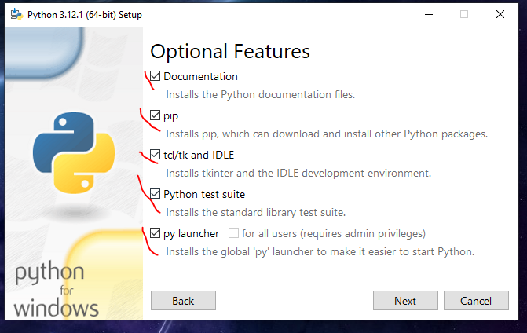
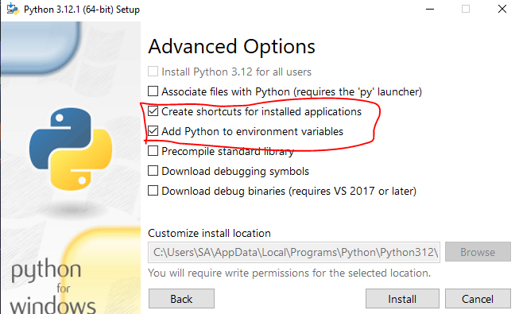
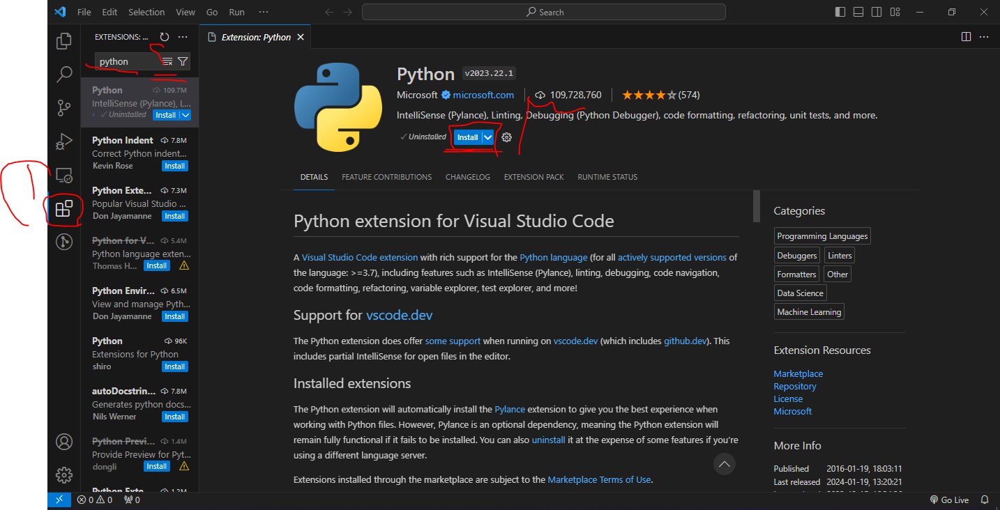
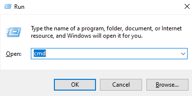
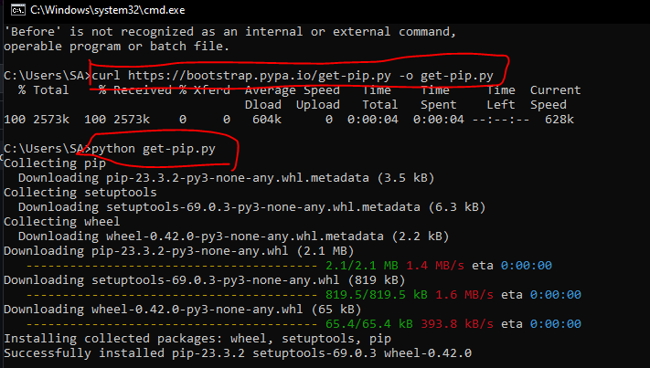
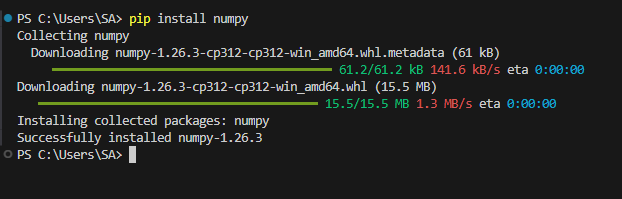

# KFU 

## البرمجة لعلوم البيانات

### شرح يخص طلاب الدبلوم في جامعة الملك فيصل الدبلوم المهني لعلوم الحاسب وتحليل البيانات 2024

تم انشاء الشرح لمساعدة طلاب دبلوم علومة الحاسب وتحليل البيانات

- شرح تثبيت محرر الاكواد فيجول ستديو كود
- شرح تثبيت البايثون
- شرح تثبيت الpip
- شرح تثبيت مكتبات تحليل البيانات في لغة بايثون

## VSCode
- ادخل على من هنا الرابط وحمل محرر الاكواد وثبته على جهازك [اضغط هنا](https://code.visualstudio.com/)

## Python
- ادخل على الرابط وحمل لغة البايثون [اضغط هنا](https://www.python.org/)
- امور مهمة ويجب مراعتها عند تثبيت لغة البايثون لتجنب حدوث مشاكل عند تثبيت الحزم الصور بالأسفل

#### في حال لم تفهم هنا فيديو باليوتيوب يشرح خطوات تثبيت البايثون
[اضغط هنا](https://www.youtube.com/watch?v=02a5T6ktx8M&list=PLDoPjvoNmBAyE_gei5d18qkfIe-Z8mocs&index=2&ab_channel=ElzeroWebSchool)

## Pip
- تثبيت مدير الحزم Pip
- البيب هو مدير الحزم يساعدك في تحميل و تضمين أي حزمة تريد في مشاريعك بكل سهولة بدل أن تضطر إلى أن تبحث عنهم بنفسك في النت مثل مكتبة الnumpy
- شرح تثبيت البيب للغلة البايثون
- حمل الملف التالي اضغط هنا [get-pip.py](https://bootstrap.pypa.io/get-pip.py)
- افتح موجه الأوامر Command Prompt عن طريق الضغط على زر علامة الويندوز + R

- اضغط انتر
- انسخ الاوامر التالية واكتبها في موجه الاوامر مثل ماهو موضح بالصورة في الاسفل

        
        - curl https://bootstrap.pypa.io/get-pip.py -o get-pip.py
        - python get-pip.py
  

## Numpy
- تثبيت مكتبة Numpy
- بعد تثبيت مدير الحزم pip كرر الخطوة السابقة وافتح موجه الاوامر عن طريق الضغط على علامة الويندوز + R وانسخ الامر التالي واضغط Enter
- pip install numpy

### النهاية

