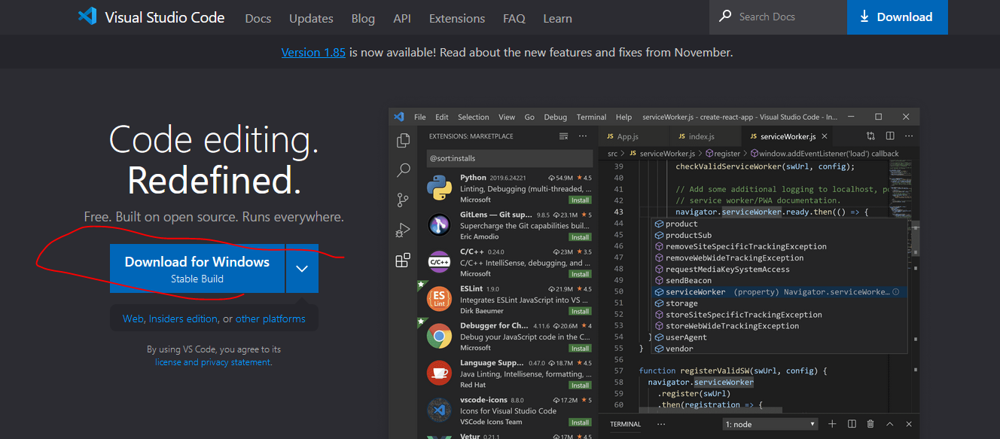

# KFU 

## البرمجة لعلوم البيانات

### شرح يخص طلاب الدبلوم في جامعة الملك فيصل الدبلوم المهني لعلوم الحاسب وتحليل البيانات 2024

تم انشاء الشرح لمساعدة طلاب دبلوم علومة الحاسب وتحليل البيانات

- شرح تثبيت محرر الاكواد فيجول ستديو كود
- شرح تثبيت البايثون
- شرح تثبيت الpip
- شرح تثبيت مكتبات تحليل البيانات في لغة بايثون

### VSCODE
- ادخل على الرابط بالأسفل وحمل محرر الاكواد وثبته على جهازك
 
[Click Here](https://code.visualstudio.com/)

### Python

### Pip
- البيب هو مدير الحزم يساعدك في تحميل و تضمين أي حزمة تريد في مشاريعك بكل سهولة بدل أن تضطر إلى أن تبحث عنهم بنفسك في النت مثل مكتبة الnumpy
- شرح تثبيت البيب للغلة البايثون
- حمل الملف التالي اضغط هنا [get-pip.py](https://bootstrap.pypa.io/get-pip.py)
- افتح موجه الأوامر Command Prompt عن طريق الضغط على زر علامة الويندوز مع حرف الR
- انسخ الاوامر التالية واكتبها في موجه الاوامر مثل ماهو موضح بالصورة في الاسفل
- curl https://bootstrap.pypa.io/get-pip.py -o get-pip.py
- python get-pip.py

### Numpy
- بكل بساطة بعد تثبيت الpip كرر الخطوة السابقة وافتح موجه الاوامر عن طريق الضغط على علامة الويندوز + R وانسخ الامر الي بالاسفل واضغط Enter
- pip install numpy

### اذا واجهتك مشكلة او مثل هذا الخطأ

